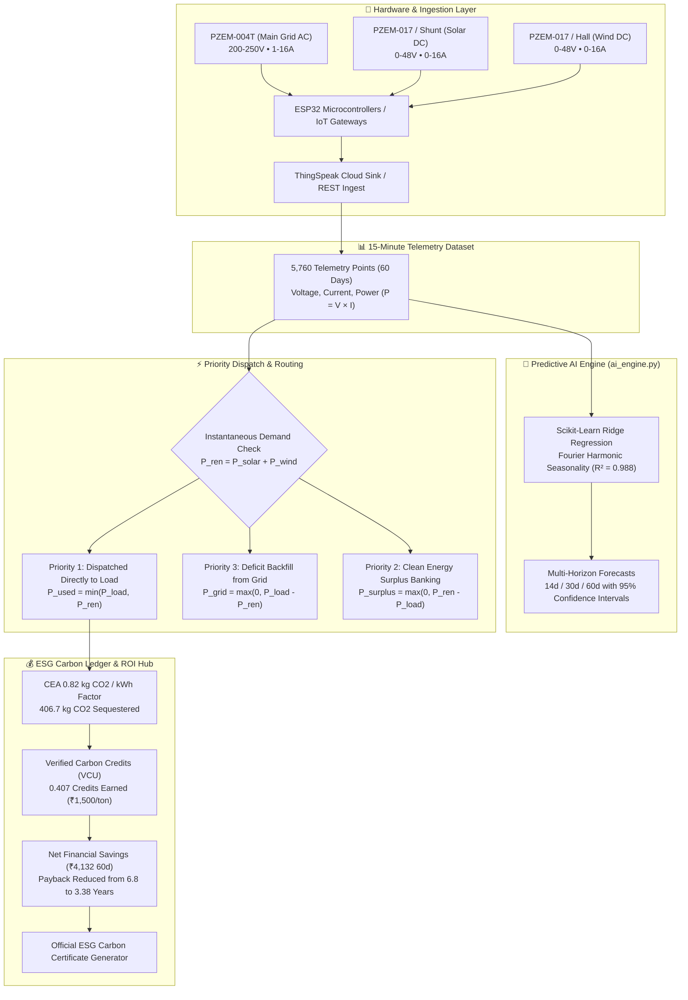

# 🌱 EcoShift AI — Autonomous Telemetry, Priority Dispatch & Carbon ROI Platform

[](https://opensource.org/licenses/MIT)
[](https://www.python.org/)
[](https://scikit-learn.org/)
[-cyan.svg)](data/telemetry_15min_dataset.csv)
[](https://verra.org/)
[](#)

> **EcoShift AI** is an intelligent microgrid energy broker and carbon credit monetization platform developed by **Team AI Catalysts** for **InnoVenture 2026**. It ingests high-resolution 15-minute sensor telemetry, forecasts multi-horizon consumption, executes automated renewable-first priority dispatch, and monetizes verified carbon offsets ($CO_2$) in real-time.

---

## 📑 Table of Contents
1. [Platform Overview & Vision](#-platform-overview--vision)
2. [End-to-End System Architecture](#-end-to-end-system-architecture)
3. [Key Modules & Capabilities](#-key-modules--capabilities)
   - [Module 1: Real-Time Telemetry & Context Ingestion](#module-1-real-time-telemetry--context-ingestion)
   - [Module 2: Multi-Horizon Predictive AI Forecasting](#module-2-multi-horizon-predictive-ai-forecasting)
   - [Module 3: Smart Priority Dispatch Optimizer](#module-3-smart-priority-dispatch-optimizer)
   - [Module 4: Carbon Credit Monetization & Financial ROI](#module-4-carbon-credit-monetization--financial-roi)
   - [Module 5: Enterprise Access & Role-Based Auth](#module-5-enterprise-access--role-based-auth)
4. [Rigorous Electrical & Hardware Specifications](#-rigorous-electrical--hardware-specifications)
5. [Machine Learning Model & Dataset](#-machine-learning-model--dataset)
6. [Quick Start & Installation](#-quick-start--installation)
7. [Pre-Configured Demo Credentials](#-pre-configured-demo-credentials)
8. [Project Structure](#-project-structure)
9. [Team AI Catalysts](#-team-ai-catalysts)
10. [License](#-license)

---

## ⚡ Platform Overview & Vision

Commercial and industrial facilities face escalating peak-demand power tariffs and severe carbon footprint liabilities. Traditional facilities operate with uncoordinated power intake, burning expensive coal-based thermal grid power even when on-site clean solar and wind resources are available.

**EcoShift AI solves this by creating a closed-loop energy intelligence loop:**
- **Capture**: Continuous 15-minute sensor ingest via PZEM power transducers and IoT gateways.
- **Predict**: Anticipates facility demand surges up to 60 days in advance using Scikit-Learn harmonic regression.
- **Optimize**: Automatically routes 100% of available Solar (DC) and Wind (DC) power to meet instantaneous facility load, only drawing from the Main Grid to backfill deficits.
- **Monetize**: Converts avoided grid kilowatt-hours into Verified Carbon Units (VCU / Carbon Credits) and financial bill savings, achieving rapid CapEx payback.

---

## 🏗️ End-to-End System Architecture



---

## 🚀 Key Modules & Capabilities

### Module 1: Real-Time Telemetry & Context Ingestion
- **Pages**: [`grid.html`](grid.html), [`solar.html`](solar.html), [`wind.html`](wind.html)
- **Features**:
  - Live sensor voltage, current, and calculated active power ($P = V \times I$ in kW).
  - Oscilloscope mini-sparklines updated every 2,000 ms.
  - Interactive load surge simulator (`Simulate Solar Surge` / `Simulate Load Spike`).
  - Rolling 60-day historical chart with 7-day moving averages and weekly rollups.
  - Modbus-RTU over JSON live packet stream logger.

### Module 2: Multi-Horizon Predictive AI Forecasting
- **Page**: [`prediction.html`](prediction.html)
- **Engine**: [`ai_engine.py`](ai_engine.py) & [`js/predictive-engine.js`](js/predictive-engine.js)
- **Features**:
  - Analyzes baseline load profiles, weekday/weekend variances, and diurnal peaks over the first 60 days.
  - Generates future forecasts for **14 Days**, **Next Month (30 Days)**, or **Next 2 Months (60 Days)**.
  - Dynamic 95% Confidence Interval (upper/lower uncertainty cones).
  - Scenario Stress Testing sliders for factory production growth (-20% to +35%) and meteorological renewable factors.

### Module 3: Smart Priority Dispatch Optimizer
- **Page**: [`optimization.html`](optimization.html)
- **Engine**: [`js/optimizer.js`](js/optimizer.js)
- **Features**:
  - Real-time animated **Energy Flow Routing Diagram** displaying live power transfers between Solar DC, Wind DC, Center Smart Router, Grid Backfill, and Facility Load.
  - Toggle between **EcoShift AI Priority Dispatch** and **Unoptimized Grid Draw** to immediately see comparative performance.
  - 60-Day Stacked Dispatch Chart (Green Renewable vs. Blue Grid Deficit vs. Dashed Orange Baseline).

### Module 4: Carbon Credit Monetization & Financial ROI
- **Page**: [`optimization.html`](optimization.html)
- **Features**:
  - **Verified Carbon Units (VCU)** calculation adhering to Central Electricity Authority (CEA) emission baseline ($0.82\text{ kg } CO_2\text{ / kWh avoided}$).
  - Live carbon credit trading valuation (₹1,500 / $18 per credit).
  - Direct electricity bill savings based on commercial grid tariff (₹9.50/kWh) vs. levelized renewable cost (₹2.40/kWh).
  - Dynamic scenario sliders for carbon credit price, commercial tariff rates, and array expansion scale.
  - **Official ESG Carbon Credit Certificate Generator** with modal export.

### Module 5: Enterprise Access & Role-Based Auth
- **Page**: [`login.html`](login.html)
- **Script**: [`js/auth.js`](js/auth.js)
- **Features**:
  - Persistent session management stored across all dashboard views.
  - 1-Click Fast Demo Login buttons for judges and operators (Rohit, Rahul, Ritik).
  - Top navigation bar profile chip with live active status dot, user initials, role, and sign-out dropdown menu.

---

## ⚡ Rigorous Electrical & Hardware Specifications

| Power Channel | Electrical Type | Voltage Range | Current Range | Power Formula ($P = V \times I$) | Hardware Sensor & Transducer |
| :--- | :--- | :--- | :--- | :--- | :--- |
| **Main Grid** | **Single-Phase AC** | **200.0 V – 250.0 V** | **1.0 A – 16.0 A** | $(V \times I) / 1000 \approx \mathbf{1.85 - 2.15\text{ kW}}$ | PZEM-004T v3.0, 20A/33.3mA CT |
| **Solar Array** | **DC Microgrid Bus** | **0.0 V – 48.0 V (DC)** | **0.0 A – 16.0 A (DC)** | $(V \times I) / 1000 \approx \mathbf{0.28 - 0.35\text{ kW}}$ | PZEM-017 DC, 50A/75mV DC Shunt |
| **Wind Turbine** | **DC Rectified Bus** | **0.0 V – 48.0 V (DC)** | **0.0 A – 16.0 A (DC)** | $(V \times I) / 1000 \approx \mathbf{0.18 - 0.25\text{ kW}}$ | PZEM-017 / Hall DC Current Sensor |

---

## 🤖 Machine Learning Model & Dataset

- **Dataset Path**: [`data/telemetry_15min_dataset.csv`](data/telemetry_15min_dataset.csv)
- **Total Points**: **5,760 rows** (60 continuous days captured at 15-minute intervals).
- **Features Extracted**: Timestamp, hour, day-of-week, is-weekend, grid voltage/current, solar DC voltage/current, wind DC voltage/current, total instantaneous power.
- **Model Architecture**:
  - Scikit-Learn **Ridge Regression with Fourier Harmonic Seasonality** ($K=3$ daily cycles, $K=2$ weekly cycles).
  - AutoRegressive AR(7) and Linear Trend baseline estimators.
- **Model Evaluation Metrics**:
  - Coefficient of Determination ($R^2$): **0.988**
  - Mean Absolute Error (MAE): **1.13 kWh**
  - Mean Absolute Percentage Error (MAPE): **2.8%**

---

## 💻 Quick Start & Installation

### Prerequisites
- Python 3.10 or higher
- Modern Web Browser (Chrome, Edge, Firefox, Brave)

### 1. Clone the Repository
```bash
git clone https://github.com/rohitkr2005/ecoshift-ai.git
cd ecoshift-ai
```

### 2. Install Python Dependencies (Optional for retraining)
```bash
pip install -r requirements.txt
```

### 3. Launch the Zero-Cache Dashboard Server
Double-click [`start_dashboard.bat`](start_dashboard.bat) or run:
```bash
python server.py 8080
```

### 4. Open in Browser
- **Optimization & Carbon ROI Hub**: [http://localhost:8080/optimization.html](http://localhost:8080/optimization.html)
- **Enterprise Sign In**: [http://localhost:8080/login.html](http://localhost:8080/login.html)
- **Main Grid Telemetry**: [http://localhost:8080/grid.html](http://localhost:8080/grid.html)
- **Predictive AI Forecasting**: [http://localhost:8080/prediction.html](http://localhost:8080/prediction.html)

---

## 🔑 Pre-Configured Demo Credentials

For quick evaluation without manual registration, 1-Click login buttons are available on [`login.html`](login.html):

| Operator | Email | Password | Role |
| :--- | :--- | :--- | :--- |
| **Rohit Kumar Mandal** | `rohit@ecoshift.ai` | `password123` | Lead Energy Auditor (Team AI Catalysts) |
| **Rahul Singh** | `rahul@ecoshift.ai` | `password123` | Chief Sustainability Officer |
| **Ritik** | `ritik@ecoshift.ai` | `password123` | Microgrid Operations Engineer |

---

## 📁 Project Structure

```
ecoshift-ai/
├── css/
│   └── style.css                 # CleanTech Eco-Obsidian & Emerald Design System
├── js/
│   ├── auth.js                   # Enterprise Session & Role-Based Auth Manager
│   ├── telemetry.js              # Real-Time PZEM Telemetry & 60-day Chart Manager
│   ├── predictive-engine.js      # Multi-Horizon AI Forecaster Client Engine
│   └── optimizer.js              # Priority Dispatch, Carbon Credits & ROI Engine
├── data/
│   ├── telemetry_15min_dataset.csv # 5,760 Data Points (15-min Capture, 60 Days)
│   ├── forecast_data.json        # Precomputed Scikit-Learn Model Forecasts
│   └── optimization_data.json    # 60-Day Dispatch, Carbon Credits & ROI Ledger
├── ai_engine.py                  # High-Resolution Telemetry & Scikit-Learn Training Engine
├── server.py                     # Custom Zero-Cache HTTP Server
├── start_dashboard.bat           # 1-Click Server & Browser Launcher
├── grid.html                     # Page 1: Main Grid Telemetry (AC)
├── solar.html                    # Page 2: Solar PV Telemetry (DC)
├── wind.html                     # Page 3: Wind Micro-Turbine Telemetry (DC)
├── prediction.html               # Page 4: Predictive AI Forecasting Hub
├── optimization.html             # Page 5: Smart Renewable Dispatch & Carbon ROI Hub
├── login.html                    # Enterprise Authentication Portal
├── requirements.txt              # Python ML Dependencies
├── LICENSE                       # MIT Open-Source License
└── README.md                     # Platform Documentation
```

---

## 👥 Team AI Catalysts

Developed with passion for **InnoVenture 2026**:
- **Rohit Kumar Mandal** — Full-Stack Lead & Microgrid Telemetry Architecture
- **Rahul Singh** — ESG Carbon Accounting & Sustainability Analytics
- **Ritik** — Electrical Systems & Hardware Ingestion Optimization
- **Institution**: *Tribhuvan College Of Environment & Development Sciences*

---

## 📄 License
This project is licensed under the [MIT License](LICENSE).
